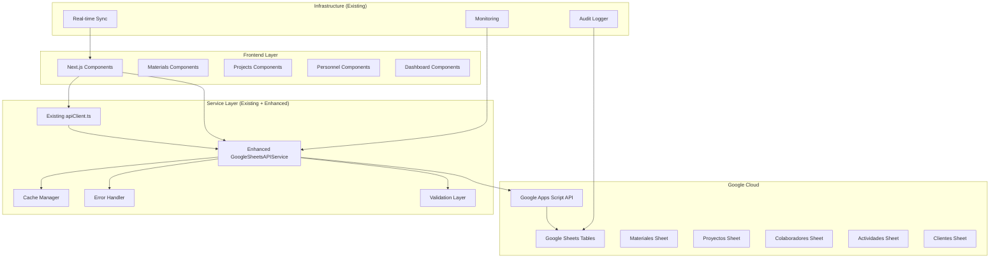

# Design Document

## Overview

Este diseño mejora la integración existente entre ServesPlatform (Next.js) y Google Sheets, aprovechando la arquitectura actual con `apiClient.ts` y `google-sheets-api-service.ts`. Se implementará un sistema robusto de operaciones CRUD con validación avanzada, caché inteligente, manejo de errores mejorado y sincronización en tiempo real, integrándose perfectamente con los componentes existentes de materiales, proyectos, personal, clientes y actividades.

## Architecture

### High-Level Architecture



### Data Flow

1. **Request Flow**: Client → API Route → Service Layer → Google Apps Script → Google Sheets
2. **Response Flow**: Google Sheets → Google Apps Script → Service Layer → API Route → Client
3. **Cache Flow**: Service Layer ↔ Client Cache (SWR)
4. **Error Flow**: Any Layer → Error Handler → Client

## Components and Interfaces

### 1. Enhanced API Service Layer

**Location**: `src/lib/api-service.ts`

```typescript
interface APIServiceConfig {
  baseUrl: string;
  token: string;
  timeout: number;
  retryAttempts: number;
  cacheEnabled: boolean;
}

interface CRUDOperation {
  table: string;
  operation: 'list' | 'get' | 'create' | 'update' | 'delete';
  data?: any;
  filters?: Record<string, any>;
  pagination?: { page: number; limit: number };
}

class GoogleSheetsAPIService {
  async executeOperation(operation: CRUDOperation): Promise<APIResponse>;
  async batchOperations(operations: CRUDOperation[]): Promise<APIResponse[]>;
  async validateConnection(): Promise<boolean>;
}
```

### 2. Data Validation Layer

**Location**: `src/lib/validation/`

```typescript
interface ValidationRule {
  field: string;
  type: 'required' | 'email' | 'number' | 'date' | 'custom';
  message: string;
  customValidator?: (value: any) => boolean;
}

interface TableSchema {
  tableName: string;
  fields: ValidationRule[];
  relationships?: RelationshipRule[];
}

class DataValidator {
  validateRecord(tableName: string, data: any): ValidationResult;
  validateBatch(tableName: string, records: any[]): ValidationResult[];
}
```

### 3. Cache Management System

**Location**: `src/lib/cache/`

```typescript
interface CacheConfig {
  ttl: number; // Time to live in seconds
  maxSize: number;
  strategy: 'lru' | 'fifo';
}

class CacheManager {
  get(key: string): Promise<any>;
  set(key: string, value: any, ttl?: number): Promise<void>;
  invalidate(pattern: string): Promise<void>;
  clear(): Promise<void>;
}
```

### 4. Real-time Sync Manager

**Location**: `src/lib/sync/`

```typescript
interface SyncEvent {
  table: string;
  operation: string;
  recordId: string;
  timestamp: Date;
  userId: string;
}

class SyncManager {
  subscribeToChanges(table: string, callback: (event: SyncEvent) => void): void;
  broadcastChange(event: SyncEvent): void;
  getLastSync(table: string): Date;
}
```

## Data Models

### Enhanced Google Apps Script Response Format

```typescript
interface APIResponse<T = any> {
  ok: boolean;
  data?: T;
  message?: string;
  status: number;
  timestamp: string;
  pagination?: {
    page: number;
    limit: number;
    total: number;
    hasNext: boolean;
  };
  metadata?: {
    executionTime: number;
    cacheHit: boolean;
    version: string;
  };
}
```

### Table Operation Interfaces

```typescript
// Materiales
interface Material {
  id: string;
  sku: string;
  descripcion: string;
  categoria: string;
  unidad: string;
  costo_ref: number;
  stock_actual: number;
  stock_minimo: number;
  proveedor_principal: string;
  ubicacion_almacen?: string;
  activo: boolean;
  created_at: string;
  updated_at: string;
}

// Proyectos
interface Proyecto {
  id: string;
  codigo: string;
  nombre: string;
  cliente_id: string;
  responsable_id: string;
  ubicacion: string;
  descripcion: string;
  linea_servicio: string;
  sla_objetivo: number;
  inicio_plan: string;
  fin_plan: string;
  presupuesto_total: number;
  moneda: 'PEN' | 'USD';
  estado: 'Planificación' | 'En progreso' | 'Pausado' | 'Cerrado';
  avance_pct: number;
  created_at: string;
  updated_at: string;
}
```

## Error Handling

### Error Classification System

```typescript
enum ErrorType {
  NETWORK_ERROR = 'NETWORK_ERROR',
  VALIDATION_ERROR = 'VALIDATION_ERROR',
  PERMISSION_ERROR = 'PERMISSION_ERROR',
  DATA_CONFLICT = 'DATA_CONFLICT',
  RATE_LIMIT = 'RATE_LIMIT',
  SERVER_ERROR = 'SERVER_ERROR'
}

interface APIError {
  type: ErrorType;
  message: string;
  details?: any;
  retryable: boolean;
  timestamp: string;
}
```

### Retry Strategy

```typescript
interface RetryConfig {
  maxAttempts: number;
  backoffMultiplier: number;
  initialDelay: number;
  maxDelay: number;
}

class RetryHandler {
  async executeWithRetry<T>(
    operation: () => Promise<T>,
    config: RetryConfig
  ): Promise<T>;
}
```

## Testing Strategy

### Unit Tests
- **API Service Layer**: Mock Google Apps Script responses
- **Validation Layer**: Test all validation rules and edge cases
- **Cache Manager**: Test cache operations and TTL behavior
- **Error Handler**: Test retry logic and error classification

### Integration Tests
- **End-to-End CRUD**: Test complete data flow from UI to Google Sheets
- **Performance Tests**: Measure response times under load
- **Offline Behavior**: Test cache fallback and sync recovery
- **Concurrent Operations**: Test data consistency with multiple users

### Test Data Management
- **Mock Data Generator**: Create realistic test datasets
- **Test Sheets**: Separate Google Sheets for testing
- **Cleanup Scripts**: Automated test data cleanup

## Performance Optimizations

### 1. Request Batching
```typescript
class BatchProcessor {
  private queue: CRUDOperation[] = [];
  private batchSize = 10;
  private flushInterval = 100; // ms
  
  addOperation(operation: CRUDOperation): Promise<any>;
  private flush(): Promise<void>;
}
```

### 2. Smart Caching Strategy
- **List Operations**: Cache for 5 minutes
- **Individual Records**: Cache for 10 minutes
- **Static Data**: Cache for 1 hour
- **Cache Invalidation**: On write operations

### 3. Pagination Implementation
```typescript
interface PaginationParams {
  page: number;
  limit: number;
  sortBy?: string;
  sortOrder?: 'asc' | 'desc';
}

class PaginationHandler {
  paginate<T>(data: T[], params: PaginationParams): PaginatedResult<T>;
}
```

## Security Considerations

### 1. API Token Management
- Secure token storage in environment variables
- Token rotation mechanism
- Request signing for sensitive operations

### 2. Data Validation
- Server-side validation for all inputs
- SQL injection prevention (even for Google Sheets)
- XSS protection for user-generated content

### 3. Rate Limiting
```typescript
class RateLimiter {
  private requests: Map<string, number[]> = new Map();
  
  isAllowed(userId: string, operation: string): boolean;
  getRemainingRequests(userId: string): number;
}
```

## Monitoring and Logging

### 1. Performance Metrics
- API response times
- Cache hit rates
- Error rates by operation type
- User activity patterns

### 2. Error Tracking
- Automatic error reporting
- Error categorization and trending
- Performance degradation alerts

### 3. Audit Trail
- All CRUD operations logged
- User action tracking
- Data change history

## Migration Strategy

### Phase 1: Core Infrastructure
1. Implement enhanced API service layer
2. Add validation and error handling
3. Set up caching system

### Phase 2: Advanced Features
1. Implement real-time sync
2. Add batch operations
3. Performance optimizations

### Phase 3: Monitoring & Analytics
1. Add comprehensive logging
2. Implement performance monitoring
3. Set up alerting system