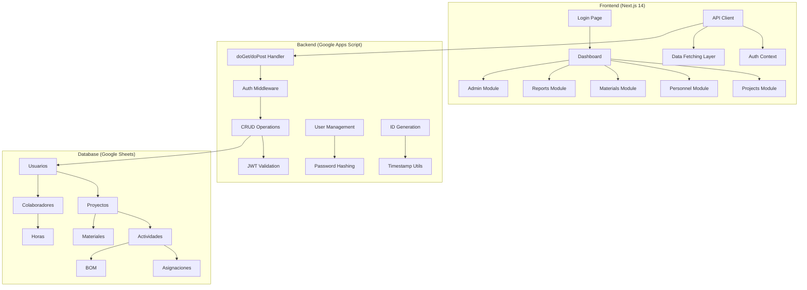
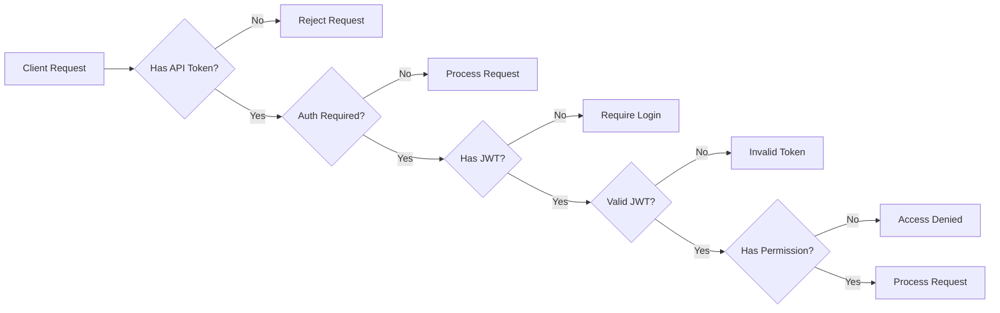

# Design Document

## Overview

ServesPlatform es una aplicación web full-stack que utiliza Next.js 14 con App Router para el frontend y Google Apps Script como backend MVP. El sistema está diseñado para ser escalable, mantenible y fácil de desplegar, aprovechando Google Sheets como base de datos inicial para facilitar la adopción.

### Architecture Stack
- **Frontend**: Next.js 14 + React + TypeScript + Tailwind CSS
- **Backend**: Google Apps Script (Web App) sirviendo API REST
- **Database**: Google Sheets (MVP) con estructura normalizada
- **Authentication**: JWT (HS256) con roles basados en permisos
- **Deployment**: Vercel (Frontend) + Google Apps Script (Backend)

## Architecture

### High-Level Architecture



### Security Architecture



## Components and Interfaces

### Frontend Component Structure

```
app/
├── (auth)/
│   └── login/
│       └── page.tsx                 # Login form with role-based redirect
├── dashboard/
│   └── page.tsx                     # Main dashboard with KPIs
├── proyectos/
│   ├── page.tsx                     # Projects list with filters
│   ├── [id]/
│   │   └── page.tsx                 # Project detail with tabs
│   └── nuevo/
│       └── page.tsx                 # New project form
├── personal/
│   ├── page.tsx                     # Personnel management
│   └── [id]/
│       └── page.tsx                 # Personnel detail
├── materiales/
│   └── page.tsx                     # Materials and BOM management
├── reportes/
│   └── page.tsx                     # Reports with export functionality
├── admin/
│   └── usuarios/
│       └── page.tsx                 # User management (admin only)
├── config/
│   └── page.tsx                     # System configuration
├── docs/
│   └── page.tsx                     # Documentation and SOPs
└── layout.tsx                       # Root layout with providers

components/
├── layout/
│   ├── Sidebar.tsx                  # Navigation sidebar with role filtering
│   ├── Topbar.tsx                   # Header with search and user menu
│   └── ProtectedRoute.tsx           # Route protection HOC
├── ui/
│   ├── CardKpi.tsx                  # KPI display cards
│   ├── Table.tsx                    # Reusable data table with filters
│   ├── Modal.tsx                    # Modal dialog component
│   ├── ConfirmDialog.tsx            # Confirmation dialogs
│   ├── Badge.tsx                    # Status badges
│   └── ExportCsv.tsx                # CSV export functionality
├── forms/
│   ├── FormProject.tsx              # Project creation/edit form
│   ├── FormActivity.tsx             # Activity management form
│   └── FormUser.tsx                 # User management form
├── project/
│   ├── Kanban.tsx                   # Activity kanban board
│   ├── MiniGantt.tsx                # Weekly gantt view
│   └── ProjectTabs.tsx              # Project detail tabs
└── charts/
    ├── ProgressChart.tsx            # Progress visualization
    └── UtilizationChart.tsx         # Resource utilization charts

lib/
├── apiClient.ts                     # Centralized API client
├── auth.ts                          # Authentication utilities
├── jwt.ts                           # JWT handling
├── permissions.ts                   # Role-based permissions
├── utils.ts                         # General utilities
└── types.ts                         # TypeScript type definitions
```

### API Interface Design

#### Authentication Endpoints
```typescript
// POST /auth
interface AuthRequest {
  email: string;
  password: string;
}

interface AuthResponse {
  ok: boolean;
  jwt?: string;
  user?: {
    id: string;
    email: string;
    nombre: string;
    rol: 'admin_lider' | 'admin' | 'editor' | 'tecnico';
  };
  message?: string;
}

// GET /whoami
interface WhoAmIResponse {
  ok: boolean;
  user?: UserProfile;
  message?: string;
}
```

#### CRUD Endpoints
```typescript
// Generic CRUD interface
interface CRUDRequest {
  table: string;
  action: 'list' | 'get' | 'create' | 'update' | 'delete';
  id?: string;
  limit?: number;
  q?: string; // search query
}

interface CRUDResponse<T> {
  ok: boolean;
  data?: T | T[];
  message?: string;
}
```

### Backend API Structure

```javascript
// Main handler structure
function handleRequest(e) {
  // 1. CORS handling
  // 2. API token validation
  // 3. Route to appropriate handler
  // 4. JWT validation (if required)
  // 5. Permission checking
  // 6. Execute operation
  // 7. Return formatted response
}

// CRUD operations with automatic mapping
function handleCRUD(table, action, data, user) {
  // 1. Get sheet by table name
  // 2. Map headers dynamically
  // 3. Apply role-based filtering
  // 4. Execute operation with validation
  // 5. Update timestamps automatically
  // 6. Return result
}
```

## Data Models

### Google Sheets Schema

#### Usuarios Sheet
```
Columns: id, email, nombre, rol, password_hash, activo, created_at, updated_at
Validation: rol IN ['admin_lider', 'admin', 'editor', 'tecnico']
Protection: Headers row protected, password_hash column hidden
```

#### Proyectos Sheet
```
Columns: id, codigo, nombre, cliente_id, responsable_id, ubicacion, descripcion, 
         linea_servicio, sla_objetivo, inicio_plan, fin_plan, presupuesto_total, 
         moneda, estado, avance_pct, created_at, updated_at
Validation: estado IN ['Planificación', 'En progreso', 'Pausado', 'Cerrado']
           moneda IN ['PEN', 'USD']
```

#### Actividades Sheet
```
Columns: id, proyecto_id, codigo, titulo, descripcion, responsable_id, prioridad, 
         estado, inicio_plan, fin_plan, checklist_id, porcentaje_avance, 
         created_at, updated_at
Validation: estado IN ['Pendiente', 'En progreso', 'En revisión', 'Completada']
           prioridad IN ['Baja', 'Media', 'Alta', 'Crítica']
```

#### Colaboradores Sheet
```
Columns: id, dni_ruc, nombres, telefono, email, especialidad, tarifa_hora, zona, 
         certificaciones_json, activo, created_at, updated_at
JSON Structure: certificaciones_json = [{"tipo": "string", "vencimiento": "date"}]
```

### TypeScript Type Definitions

```typescript
interface User {
  id: string;
  email: string;
  nombre: string;
  rol: 'admin_lider' | 'admin' | 'editor' | 'tecnico';
  activo: boolean;
  created_at: Date;
  updated_at: Date;
}

interface Project {
  id: string;
  codigo: string;
  nombre: string;
  cliente_id: string;
  responsable_id: string;
  ubicacion: string;
  descripcion: string;
  linea_servicio: string;
  sla_objetivo: number;
  inicio_plan: Date;
  fin_plan: Date;
  presupuesto_total: number;
  moneda: 'PEN' | 'USD';
  estado: 'Planificación' | 'En progreso' | 'Pausado' | 'Cerrado';
  avance_pct: number;
  created_at: Date;
  updated_at: Date;
}

interface Activity {
  id: string;
  proyecto_id: string;
  codigo: string;
  titulo: string;
  descripcion: string;
  responsable_id: string;
  prioridad: 'Baja' | 'Media' | 'Alta' | 'Crítica';
  estado: 'Pendiente' | 'En progreso' | 'En revisión' | 'Completada';
  inicio_plan: Date;
  fin_plan: Date;
  checklist_id?: string;
  porcentaje_avance: number;
  created_at: Date;
  updated_at: Date;
}
```

## Error Handling

### Frontend Error Handling Strategy

```typescript
// Centralized error handling in API client
class APIError extends Error {
  constructor(
    message: string,
    public status: number,
    public code?: string
  ) {
    super(message);
  }
}

// Error boundary for React components
class ErrorBoundary extends React.Component {
  // Handle unexpected errors gracefully
  // Show user-friendly error messages
  // Log errors for debugging
}

// Form validation with real-time feedback
const useFormValidation = (schema: ValidationSchema) => {
  // Client-side validation
  // Server-side validation integration
  // Error message display
}
```

### Backend Error Handling

```javascript
function handleError(error, context) {
  // Log error details
  console.error(`Error in ${context}:`, error);
  
  // Return user-friendly error response
  return {
    ok: false,
    message: getErrorMessage(error),
    code: getErrorCode(error)
  };
}

function validateInput(data, schema) {
  // Input validation
  // Type checking
  // Business rule validation
  // Return validation errors
}
```

## Testing Strategy

### Frontend Testing
- **Unit Tests**: Component testing with Jest and React Testing Library
- **Integration Tests**: API integration testing with MSW (Mock Service Worker)
- **E2E Tests**: Critical user flows with Playwright
- **Accessibility Tests**: WCAG compliance testing

### Backend Testing
- **Unit Tests**: Google Apps Script functions testing
- **API Tests**: Endpoint testing with different user roles
- **Data Validation Tests**: Sheet structure and data integrity
- **Security Tests**: Authentication and authorization testing

### Test Data Management
- **Seed Data**: Consistent test data for development and testing
- **Mock APIs**: Frontend development without backend dependency
- **Test Sheets**: Separate Google Sheets for testing environment

## Performance Considerations

### Frontend Optimization
- **Code Splitting**: Route-based and component-based splitting
- **Lazy Loading**: Images and non-critical components
- **Caching**: SWR for data fetching with smart cache invalidation
- **Bundle Optimization**: Tree shaking and minification

### Backend Optimization
- **Caching**: Sheet data caching for frequently accessed data
- **Batch Operations**: Minimize API calls with batch processing
- **Query Optimization**: Efficient data filtering and pagination
- **Rate Limiting**: Prevent API abuse and quota exhaustion

### Database Optimization
- **Sheet Structure**: Optimized column order and data types
- **Indexing Strategy**: Efficient data lookup patterns
- **Data Archiving**: Historical data management strategy
- **Backup Strategy**: Regular data backup and recovery procedures

## Security Implementation

### Authentication Security
- **Password Hashing**: SHA-256 with salt (upgrade to bcrypt recommended)
- **JWT Security**: HS256 with secure secret, appropriate expiration
- **Session Management**: Secure token storage and refresh strategy
- **Brute Force Protection**: Rate limiting on authentication attempts

### Authorization Security
- **Role-Based Access**: Granular permissions per role
- **Resource-Level Security**: Project and activity-level access control
- **API Security**: Token validation on every request
- **Input Validation**: Comprehensive input sanitization

### Data Security
- **Encryption**: Sensitive data encryption at rest
- **Audit Trail**: Comprehensive logging of user actions
- **Data Privacy**: PII protection and GDPR compliance considerations
- **Backup Security**: Encrypted backups with access control

## Deployment Architecture

### Frontend Deployment (Vercel)
```yaml
# vercel.json
{
  "framework": "nextjs",
  "buildCommand": "npm run build",
  "outputDirectory": ".next",
  "env": {
    "NEXT_PUBLIC_API_BASE": "@api-base-url",
    "NEXT_PUBLIC_API_TOKEN": "@api-token",
    "NEXT_PUBLIC_APP_NAME": "ServesPlatform"
  }
}
```

### Backend Deployment (Google Apps Script)
```javascript
// Deployment configuration
const CONFIG = {
  SHEET_ID: PropertiesService.getScriptProperties().getProperty('SHEET_ID'),
  API_TOKEN: PropertiesService.getScriptProperties().getProperty('API_TOKEN'),
  JWT_SECRET: PropertiesService.getScriptProperties().getProperty('JWT_SECRET'),
  ENVIRONMENT: PropertiesService.getScriptProperties().getProperty('ENVIRONMENT') || 'production'
};
```

### Environment Configuration
- **Development**: Local Next.js + Apps Script testing
- **Staging**: Vercel preview + Test Google Sheet
- **Production**: Vercel production + Production Google Sheet

## Migration Strategy

### Phase 1: MVP with Google Sheets
- Complete implementation as designed
- User acceptance testing
- Performance monitoring
- Data collection and analysis

### Phase 2: Database Migration (Future)
- Migrate to PostgreSQL/Supabase
- Maintain API compatibility
- Data migration scripts
- Performance improvements

### Phase 3: Advanced Features (Future)
- Real-time notifications
- Advanced reporting and analytics
- Mobile application
- Third-party integrations