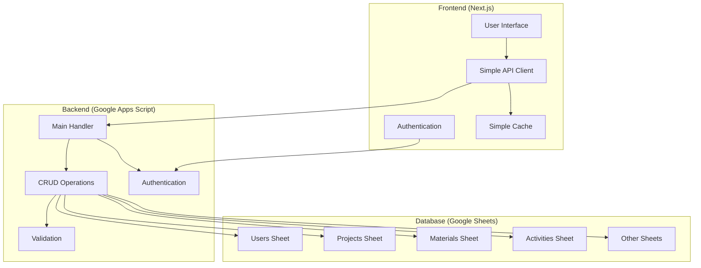

# Design Document

## Overview

This design addresses the critical architectural issues in the ServesPlatform system by consolidating the Google Apps Script backend, simplifying the frontend architecture, and establishing reliable database connectivity. The solution focuses on creating a clean, maintainable, and performant system that follows best practices while eliminating over-engineering.

## Architecture

### High-Level Architecture



### Component Architecture

The system will be restructured into clear, focused components:

1. **Single Google Apps Script File**: One consolidated backend file with clear separation of concerns
2. **Simplified Frontend API Client**: Direct communication without multiple abstraction layers
3. **Standardized Database Schema**: Consistent structure across all Google Sheets
4. **Lightweight Caching**: Simple, effective caching without over-engineering

## Components and Interfaces

### Google Apps Script Backend

#### Main Handler (`Code.gs`)
- **Purpose**: Single entry point for all API requests
- **Responsibilities**:
  - Request routing and validation
  - Authentication and authorization
  - Response formatting and error handling
  - Configuration management via Properties Service

#### CRUD Operations Module
- **Purpose**: Handle all database operations
- **Responsibilities**:
  - Create, Read, Update, Delete operations
  - Data validation and business rules
  - Sheet-specific operations
  - Batch operations for performance

#### Authentication Module
- **Purpose**: Manage user authentication and sessions
- **Responsibilities**:
  - User login/logout
  - JWT token generation and validation
  - Permission checking
  - Session management

#### Configuration Module
- **Purpose**: Centralized configuration management
- **Responsibilities**:
  - Environment-specific settings
  - API keys and secrets management
  - Feature flags
  - Database connection parameters

### Frontend Architecture

#### Simple API Client
```typescript
interface APIClient {
  // Authentication
  login(email: string, password: string): Promise<AuthResponse>
  logout(): Promise<void>
  
  // Generic CRUD operations
  list<T>(table: string, params?: QueryParams): Promise<T[]>
  get<T>(table: string, id: string): Promise<T>
  create<T>(table: string, data: Partial<T>): Promise<T>
  update<T>(table: string, id: string, data: Partial<T>): Promise<T>
  delete(table: string, id: string): Promise<void>
  
  // Batch operations
  batchCreate<T>(table: string, items: Partial<T>[]): Promise<T[]>
  batchUpdate<T>(table: string, updates: BatchUpdate<T>[]): Promise<T[]>
}
```

#### Component Structure
```
src/
├── components/
│   ├── ui/           # Basic UI components
│   ├── forms/        # Form components
│   ├── tables/       # Data display components
│   └── layout/       # Layout components
├── pages/            # Next.js pages
├── lib/
│   ├── api.ts        # Simple API client
│   ├── auth.ts       # Authentication context
│   ├── types.ts      # TypeScript definitions
│   └── utils.ts      # Utility functions
└── hooks/            # Custom React hooks
```

#### State Management
- **React Context**: For global state (authentication, user preferences)
- **SWR**: For server state management and caching
- **useState/useReducer**: For local component state

## Data Models

### Standardized Entity Models

#### User Model
```typescript
interface User {
  id: string
  email: string
  nombre: string
  rol: 'admin_lider' | 'admin' | 'editor' | 'tecnico'
  activo: boolean
  created_at: string
  updated_at: string
}
```

#### Project Model
```typescript
interface Project {
  id: string
  codigo: string
  nombre: string
  cliente_id: string
  responsable_id: string
  ubicacion: string
  descripcion: string
  linea_servicio: string
  estado: 'Planificación' | 'En progreso' | 'Pausado' | 'Cerrado'
  inicio_plan: string
  fin_plan: string
  presupuesto_total: number
  moneda: 'PEN' | 'USD'
  avance_pct: number
  created_at: string
  updated_at: string
}
```

#### Material Model
```typescript
interface Material {
  id: string
  sku: string
  descripcion: string
  categoria: string
  unidad: string
  costo_ref: number
  stock_actual: number
  stock_minimo: number
  proveedor_principal: string
  activo: boolean
  created_at: string
  updated_at: string
}
```

### Database Schema Design

#### Sheet Structure Standards
1. **Consistent Column Names**: All sheets use standardized field names
2. **Data Types**: Proper validation for dates, numbers, and enums
3. **Required Fields**: Clear indication of mandatory vs optional fields
4. **Relationships**: Foreign key references with validation
5. **Audit Fields**: created_at, updated_at, created_by for all entities

#### Validation Rules
- **Email Format**: Valid email addresses for user accounts
- **Date Ranges**: Logical date validation (start < end dates)
- **Numeric Constraints**: Positive values for costs, quantities
- **Enum Values**: Restricted lists for status fields, categories
- **Unique Constraints**: Prevent duplicate SKUs, email addresses

## Error Handling

### Backend Error Handling Strategy

#### Error Classification
```typescript
enum ErrorType {
  VALIDATION_ERROR = 'VALIDATION_ERROR',
  AUTHENTICATION_ERROR = 'AUTHENTICATION_ERROR',
  AUTHORIZATION_ERROR = 'AUTHORIZATION_ERROR',
  NOT_FOUND_ERROR = 'NOT_FOUND_ERROR',
  CONFLICT_ERROR = 'CONFLICT_ERROR',
  SERVER_ERROR = 'SERVER_ERROR'
}
```

#### Error Response Format
```typescript
interface ErrorResponse {
  ok: false
  error: {
    type: ErrorType
    message: string
    details?: any
    timestamp: string
  }
}
```

#### Error Handling Flow
1. **Input Validation**: Validate all inputs before processing
2. **Business Rule Validation**: Check business constraints
3. **Database Operation**: Perform the requested operation
4. **Error Classification**: Categorize any errors that occur
5. **User-Friendly Messages**: Return appropriate error messages
6. **Logging**: Log errors for debugging without exposing sensitive data

### Frontend Error Handling

#### Error Boundary Implementation
```typescript
class ErrorBoundary extends React.Component {
  // Catch JavaScript errors in component tree
  // Display fallback UI
  // Log errors for monitoring
}
```

#### API Error Handling
```typescript
const handleAPIError = (error: APIError) => {
  switch (error.type) {
    case 'AUTHENTICATION_ERROR':
      // Redirect to login
      break
    case 'VALIDATION_ERROR':
      // Show form validation errors
      break
    case 'SERVER_ERROR':
      // Show generic error message
      break
    default:
      // Show fallback error message
  }
}
```

## Testing Strategy

### Backend Testing

#### Unit Tests
- **CRUD Operations**: Test all database operations
- **Validation Logic**: Test business rules and constraints
- **Authentication**: Test login, logout, and token validation
- **Error Handling**: Test error scenarios and responses

#### Integration Tests
- **End-to-End API**: Test complete request/response cycles
- **Database Operations**: Test actual Google Sheets interactions
- **Authentication Flow**: Test complete auth workflows

### Frontend Testing

#### Component Tests
- **UI Components**: Test rendering and user interactions
- **Form Components**: Test validation and submission
- **Data Display**: Test data formatting and display logic

#### Integration Tests
- **API Integration**: Test frontend-backend communication
- **Authentication Flow**: Test login/logout functionality
- **CRUD Operations**: Test complete user workflows

#### End-to-End Tests
- **User Journeys**: Test complete user workflows
- **Cross-Browser**: Test compatibility across browsers
- **Performance**: Test loading times and responsiveness

### Testing Tools and Framework

#### Backend Testing
- **Google Apps Script Testing**: Custom test framework for GAS
- **Mock Data**: Standardized test datasets
- **Test Utilities**: Helper functions for common test scenarios

#### Frontend Testing
- **Vitest**: Unit and integration testing
- **React Testing Library**: Component testing
- **Playwright**: End-to-end testing
- **MSW**: API mocking for tests

## Performance Optimization

### Backend Performance

#### Optimization Strategies
1. **Batch Operations**: Group multiple operations to reduce API calls
2. **Efficient Queries**: Optimize data retrieval from sheets
3. **Caching**: Cache frequently accessed data
4. **Lazy Loading**: Load data only when needed
5. **Compression**: Compress large responses

#### Google Sheets Optimization
- **Range Operations**: Use batch range operations instead of cell-by-cell
- **Data Validation**: Implement client-side validation to reduce server calls
- **Pagination**: Implement proper pagination for large datasets
- **Indexing**: Use helper columns for faster lookups

### Frontend Performance

#### Optimization Techniques
1. **Code Splitting**: Split bundles for faster initial load
2. **Lazy Loading**: Load components and routes on demand
3. **Memoization**: Cache expensive computations
4. **Virtual Scrolling**: Handle large lists efficiently
5. **Image Optimization**: Optimize images and assets

#### Caching Strategy
```typescript
// Simple SWR-based caching
const { data, error, mutate } = useSWR(
  ['projects', filters],
  () => api.getProjects(filters),
  {
    revalidateOnFocus: false,
    dedupingInterval: 60000, // 1 minute
    errorRetryCount: 3
  }
)
```

## Security Considerations

### Authentication and Authorization

#### JWT Implementation
- **Secure Token Generation**: Use strong secrets and proper algorithms
- **Token Expiration**: Implement reasonable token lifetimes
- **Refresh Tokens**: Handle token renewal gracefully
- **Secure Storage**: Store tokens securely in the frontend

#### Permission System
```typescript
interface Permission {
  resource: string
  action: 'read' | 'write' | 'delete'
  conditions?: Record<string, any>
}

interface Role {
  name: string
  permissions: Permission[]
}
```

### Data Protection

#### Input Validation
- **Sanitization**: Clean all user inputs
- **Type Checking**: Validate data types and formats
- **Business Rules**: Enforce business constraints
- **SQL Injection Prevention**: Use parameterized queries (where applicable)

#### Secure Communication
- **HTTPS Only**: Enforce secure connections
- **CORS Configuration**: Proper cross-origin resource sharing
- **API Rate Limiting**: Prevent abuse and DoS attacks
- **Error Message Security**: Avoid exposing sensitive information

## Deployment and Configuration

### Environment Management

#### Configuration Structure
```typescript
interface Config {
  environment: 'development' | 'staging' | 'production'
  api: {
    baseUrl: string
    timeout: number
    retryAttempts: number
  }
  database: {
    spreadsheetId: string
    cacheTimeout: number
  }
  auth: {
    jwtSecret: string
    tokenExpiration: number
  }
}
```

#### Google Apps Script Deployment
1. **Properties Service**: Store configuration securely
2. **Version Management**: Use GAS version control
3. **Environment Variables**: Separate dev/staging/prod configs
4. **Deployment Scripts**: Automate deployment process

### Monitoring and Logging

#### Logging Strategy
```typescript
interface LogEntry {
  timestamp: string
  level: 'debug' | 'info' | 'warn' | 'error'
  message: string
  context?: Record<string, any>
  userId?: string
  requestId?: string
}
```

#### Performance Monitoring
- **API Response Times**: Track request/response performance
- **Error Rates**: Monitor error frequency and types
- **User Activity**: Track user engagement and usage patterns
- **System Health**: Monitor system availability and performance

## Migration Strategy

### Phase 1: Backend Consolidation
1. **Audit Current Files**: Identify all existing GAS files
2. **Extract Core Logic**: Identify essential functionality
3. **Create Unified Backend**: Consolidate into single file
4. **Test Thoroughly**: Ensure all functionality works
5. **Deploy and Validate**: Deploy to staging environment

### Phase 2: Frontend Simplification
1. **Simplify API Client**: Remove unnecessary abstractions
2. **Streamline Components**: Simplify component architecture
3. **Update State Management**: Implement simple state patterns
4. **Test Integration**: Ensure frontend-backend communication
5. **Performance Testing**: Validate performance improvements

### Phase 3: Database Standardization
1. **Schema Analysis**: Document current schema
2. **Design Standard Schema**: Create consistent structure
3. **Data Migration**: Migrate existing data safely
4. **Validation Implementation**: Add proper data validation
5. **Testing and Validation**: Ensure data integrity

### Phase 4: Testing and Optimization
1. **Comprehensive Testing**: Implement full test suite
2. **Performance Optimization**: Apply performance improvements
3. **Security Hardening**: Implement security measures
4. **Documentation**: Create comprehensive documentation
5. **Production Deployment**: Deploy to production environment